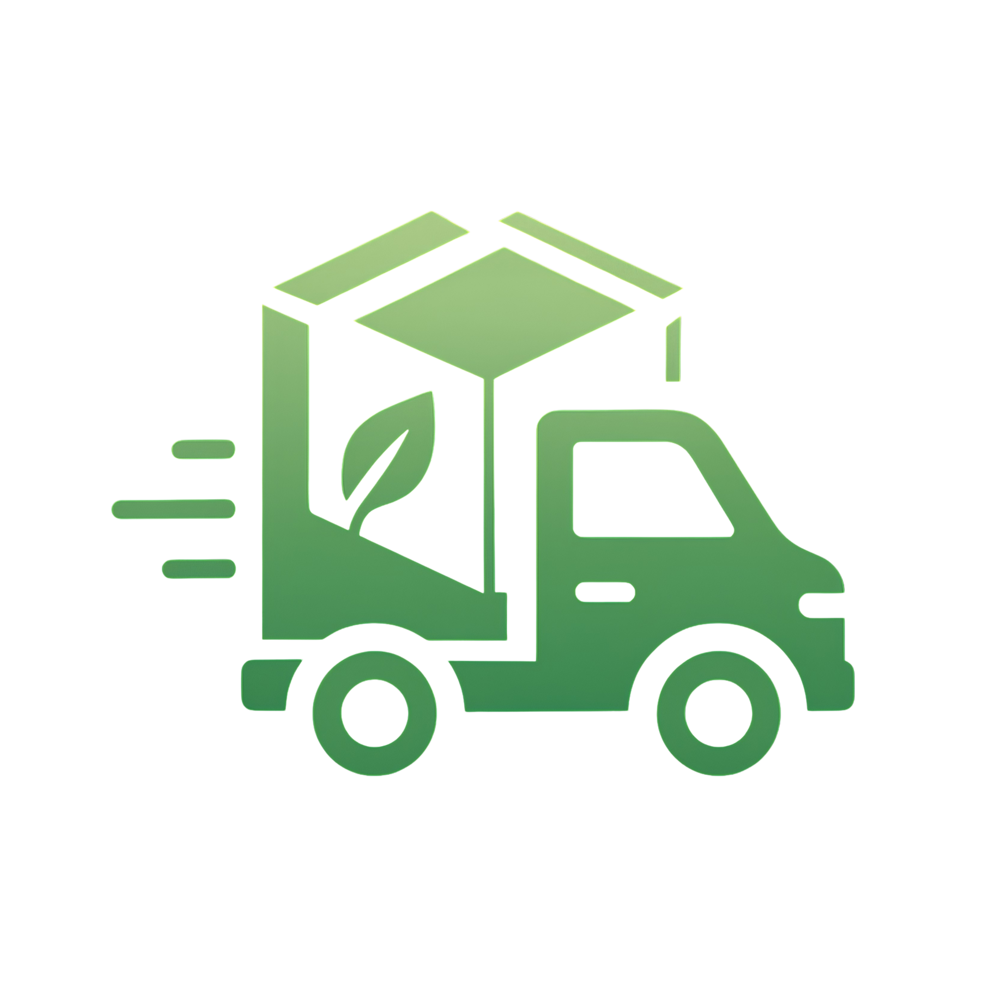

# LokaTrack

LokaTrack is a mobile application developed using the Flutter framework. This application is designed to provide comprehensive tracking and delivery management solutions.



## 🚀 Key Features

- User Authentication System
- Delivery Management Dashboard
- Modern and Responsive Interface
- User Profile Management
- Image Upload Functionality
- Secure API Communication

## 📱 Technology Stack

- Flutter SDK ^3.7.2
- Core Dependencies:
  - flutter_animate: ^4.2.0 (for smooth animations)
  - glassmorphism: ^3.0.0 (for modern glass-like UI effects)
  - image_picker: ^0.8.7+5 (for image upload functionality)
  - http: ^1.2.1 (for API communication)
  - flutter_svg: ^2.0.17 (for SVG image rendering)
  - intl: ^0.18.0 (for internationalization)

## 🛠️ Getting Started

### Prerequisites

Before running the application, ensure you have the following installed:
- [Flutter SDK](https://flutter.dev/docs/get-started/install) (version ^3.7.2)
- [Android Studio](https://developer.android.com/studio) or [VS Code](https://code.visualstudio.com/)
- [Git](https://git-scm.com/)
- A compatible Android/iOS device or emulator

### Installation Steps

1. Clone the repository
```bash
git clone https://github.com/yourusername/lokatrack.git
cd lokatrack
```

2. Install dependencies
```bash
flutter pub get
```

3. Run the application
```bash
# For debug mode
flutter run

# For release mode
flutter run --release
```

### Building for Production

To create a release build:

For Android:
```bash
flutter build apk --release
```

For iOS:
```bash
flutter build ios --release
```
